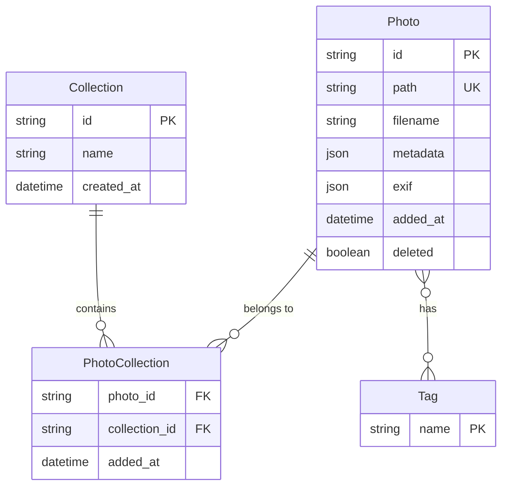

# 設計書

## 概要
写真作品管理及び閲覧アプリは、Tauri v2 + React 18 + TypeScriptによるクロスプラットフォームデスクトップアプリケーションです。本機能は写真家に対して、ローカルファイルシステム上の写真を効率的に管理・閲覧・分類する環境を提供します。

**ユーザー:** 写真家、フォトグラファーが、作品の整理、メタデータ付与、検索、閲覧といったワークフローに利用します。

**影響:** 現在のテンプレートアプリケーション（greet機能のみ）を写真管理に特化したフル機能アプリケーションに変更します。

### ゴール
- ローカルフォルダから写真を読み込み、グリッドビューで一覧表示
- 画像詳細表示とキーボードナビゲーション、EXIF情報表示
- タグ、レーティング、説明によるメタデータ管理とSQLite永続化
- フィルタリング、検索、ソート機能による作品の絞り込み
- お気に入り・コレクション機能による作品グルーピング
- 選択画像のエクスポート機能（リサイズ・メタデータ保持オプション付）
- 1000枚以上の画像を扱う際のパフォーマンス維持（仮想スクロール、非同期サムネイル生成）

### 非ゴール
- クラウドストレージ連携（Googleフォト、iCloud等）
- 複数デバイス間でのデータ同期
- RAW画像の現像機能
- 画像編集機能（トリミング、フィルタ、色調整等）
- ソーシャルメディアへの直接投稿

## アーキテクチャ

### 既存アーキテクチャ分析
現在のコードベースはTauri v2テンプレートであり、以下の構成を持ちます：
- フロントエンド: React 18 + TypeScript + Vite
- バックエンド: Rust (Tauri) with `greet` コマンド
- 制約: シンプルなコマンドベースアーキテクチャ、状態管理未導入

本設計では既存のTauriコマンドパターンを踏襲し、Reactコンポーネントベースアーキテクチャを拡張します。

### アーキテクチャパターンと境界マップ

**アーキテクチャ統合:**
- **選択パターン:** レイヤードアーキテクチャ + Tauri IPC (Inter-Process Communication)
  - フロントエンド（React UI層）とバックエンド（Rust処理層）を明確に分離
  - Tauriコマンド経由でファイルシステムアクセス、EXIF読み取り、DB操作を実行
- **ドメイン境界:**
  - UI層: コンポーネント、状態管理、ユーザーインタラクション
  - アプリケーション層: ビジネスロジック、フィルタリング、ソート
  - インフラ層: ファイルI/O、SQLite永続化、EXIF解析（Rust側）
- **既存パターンの保持:** Tauriコマンドハンドラパターン、Reactコンポーネント構成
- **新規コンポーネント理由:**
  - データベースレイヤー: メタデータ永続化のためSQLiteを導入
  - 状態管理: Zustand/Jotai等軽量ライブラリで写真リスト、フィルタ状態を一元管理
  - 仮想スクロール: react-window等でパフォーマンス確保


### テクノロジースタック

| レイヤー | 技術選択 / バージョン | 役割 | 備考 |
|---------|---------------------|------|------|
| Frontend | React 18.3 + TypeScript 5.6 | UIレンダリング、ユーザーインタラクション | 既存スタック継続 |
| State Management | Zustand 4.x | グローバル状態管理（写真リスト、フィルタ、選択状態） | 軽量、React 18対応、TypeScript親和性高 |
| UI Components | react-window 1.8.x | 仮想スクロール実装 | 大量画像表示時のパフォーマンス維持 |
| Backend | Tauri 2.x + Rust 1.70+ | ファイルアクセス、DB操作、EXIF解析 | 既存スタック継続 |
| Database | SQLite 3.x (rusqlite crate) | メタデータ永続化 | ローカル、軽量、組込み型DB |
| EXIF Parser | kamadak-exif (Rust crate) | EXIF情報抽出 | Rust純正、高速 |
| Image Processing | image (Rust crate) | サムネイル生成、リサイズ | クロスプラットフォーム対応 |
| File Dialog | @tauri-apps/plugin-dialog | フォルダ・ファイル選択 | Tauriネイティブプラグイン |

## システムフロー

### フォルダ読み込みフロー


### 画像詳細表示・ナビゲーションフロー


### メタデータ更新フロー


## 要件トレーサビリティ

| 要件 | 概要 | コンポーネント | インターフェース | フロー |
|------|------|---------------|----------------|--------|
| 1 | 写真読み込み・一覧表示 | PhotoGrid, FileSystemService | scan_images, get_thumbnails | フォルダ読み込みフロー |
| 2 | 詳細表示・ナビゲーション | PhotoViewer, KeyboardHandler | get_photo_detail | 詳細表示フロー |
| 3 | メタデータ管理 | MetadataPanel, SQLiteService | update_metadata, get_tags | メタデータ更新フロー |
| 4 | フィルタリング・検索 | FilterBar, SearchEngine | filter_photos, search_photos | フィルタリング処理 |
| 5 | ソート機能 | SortControl | sort_photos | ソート処理 |
| 6 | お気に入り・コレクション | CollectionManager, SQLiteService | add_to_collection, get_favorites | コレクション管理 |
| 7 | エクスポート | ExportDialog, ImageProcessor | export_photos | エクスポート処理 |
| 8 | データ永続化 | SQLiteService | init_database, backup_data | DB初期化・バックアップ |
| 9 | パフォーマンス | VirtualizedGrid, ThumbnailCache | - | 仮想スクロール |
| 10 | クロスプラットフォーム | Tauri Runtime | - | Tauriビルド設定 |

## コンポーネントとインターフェース

### コンポーネント概要

| コンポーネント | ドメイン/レイヤー | 意図 | 要件カバー | 主要依存 | 契約 |
|---------------|-----------------|------|-----------|----------|------|
| PhotoGrid | UI/表示 | グリッドレイアウトで写真一覧表示 | 1, 9 | react-window (P0), Zustand (P0) | State |
| PhotoViewer | UI/表示 | 詳細表示モード、ナビゲーション | 2 | Zustand (P0) | State, Service |
| MetadataPanel | UI/編集 | メタデータ編集UI | 3 | SQLiteService (P0) | Service, State |
| FilterBar | UI/検索 | フィルタ・検索UI | 4 | Zustand (P0) | State |
| SortControl | UI/制御 | ソート選択UI | 5 | Zustand (P0) | State |
| CollectionManager | UI/管理 | コレクション管理UI | 6 | SQLiteService (P0) | Service, State |
| ExportDialog | UI/操作 | エクスポート設定UI | 7 | ImageProcessor (P0) | Service |
| FileSystemService | Rust/インフラ | ファイルスキャン、読み込み | 1, 7 | tauri-plugin-fs (P0) | Service |
| EXIFService | Rust/インフラ | EXIF情報抽出 | 2 | kamadak-exif (P0) | Service |
| SQLiteService | Rust/インフラ | メタデータ永続化 | 3, 6, 8 | rusqlite (P0) | Service |
| ImageProcessor | Rust/インフラ | サムネイル生成、リサイズ | 1, 7, 9 | image crate (P0) | Service |
| ThumbnailCache | Rust/インフラ | サムネイルキャッシュ管理 | 9 | - | State |

### UI層

#### PhotoGrid

| 項目 | 詳細 |
|------|------|
| 意図 | 仮想スクロールによる高速グリッド表示 |
| 要件 | 1, 9 |

**責務と制約**
- 写真リストを受け取り、グリッドレイアウトで表示
- react-windowを用いた仮想スクロール実装
- サムネイルクリック時に詳細表示モードへ遷移

**依存関係**
- Inbound: Zustand photoStore — 写真リスト取得 (P0)
- Outbound: ImageProcessor — サムネイルURL取得 (P0)
- External: react-window — 仮想スクロール (P0)

**契約**: State [x]

##### State Management
```typescript
interface PhotoStore {
  photos: Photo[];
  selectedPhotoId: string | null;
  viewMode: 'grid' | 'detail';
  setSelectedPhoto: (id: string) => void;
  setViewMode: (mode: 'grid' | 'detail') => void;
}

interface Photo {
  id: string;
  path: string;
  filename: string;
  thumbnailPath?: string;
  exif?: EXIFData;
  metadata: PhotoMetadata;
  addedAt: Date;
}
```

**実装ノート**
- グリッドカラム数はウィンドウ幅に応じて動的調整（CSS Grid使用）
- サムネイルロードはlazyロード、Intersection Observer使用
- 選択状態はZustandで管理し、詳細表示と連携

#### PhotoViewer

| 項目 | 詳細 |
|------|------|
| 意図 | フルサイズ画像表示、キーボードナビゲーション、EXIF表示 |
| 要件 | 2 |

**責務と制約**
- 選択画像をフルサイズまたはウィンドウフィット表示
- 矢印キー、Escキーのキーボードイベント処理
- EXIF情報、メタデータのサイドパネル表示
- ズームイン/アウト機能（transform: scale使用）

**依存関係**
- Inbound: Zustand photoStore — 選択写真ID、写真リスト (P0)
- Outbound: EXIFService — EXIF情報取得 (P0)

**契約**: State [x], Service [x]

##### Service Interface
```typescript
interface PhotoViewerService {
  navigateNext(): void;
  navigatePrevious(): void;
  closeViewer(): void;
  zoomIn(): void;
  zoomOut(): void;
  resetZoom(): void;
}
```

**実装ノート**
- キーボードイベントはuseEffectでグローバルリスナー登録
- 画像プリロード（前後1枚ずつ）でナビゲーション高速化
- ズーム倍率は1.0〜5.0の範囲で0.5刻み

#### MetadataPanel

| 項目 | 詳細 |
|------|------|
| 意図 | タグ、レーティング、説明文の編集UI |
| 要件 | 3 |

**責務と制約**
- タグ入力（オートコンプリート付き）
- レーティング選択（1〜5つ星）
- 説明文テキストエリア
- 変更時に自動保存（debounce 500ms）

**依存関係**
- Inbound: Zustand photoStore — 選択写真メタデータ (P0)
- Outbound: SQLiteService — メタデータ更新 (P0)

**契約**: Service [x], State [x]

##### Service Interface
```typescript
interface MetadataService {
  updateTags(photoId: string, tags: string[]): Promise<Result<void, Error>>;
  updateRating(photoId: string, rating: number): Promise<Result<void, Error>>;
  updateDescription(photoId: string, description: string): Promise<Result<void, Error>>;
  getAllTags(): Promise<string[]>;
}
```

**実装ノート**
- タグ入力はreact-selectまたはMUI Autocomplete使用
- レーティングはStarアイコンコンポーネント（カスタムまたはMUI Rating）
- 自動保存はlodash.debounce使用

#### FilterBar

| 項目 | 詳細 |
|------|------|
| 意図 | タグ、レーティング、日付範囲によるフィルタUI |
| 要件 | 4 |

**責務と制約**
- 複数タグ選択（AND条件）
- レーティング最小値選択
- 撮影日範囲選択（DatePicker）
- キーワード検索入力
- フィルタ条件はZustandで管理

**依存関係**
- Inbound: Zustand filterStore — フィルタ条件 (P0)
- Outbound: Zustand photoStore — フィルタ適用後リスト更新 (P0)

**契約**: State [x]

##### State Management
```typescript
interface FilterStore {
  filters: PhotoFilters;
  setTagFilter: (tags: string[]) => void;
  setRatingFilter: (minRating: number) => void;
  setDateRangeFilter: (start?: Date, end?: Date) => void;
  setKeywordFilter: (keyword: string) => void;
  clearFilters: () => void;
}

interface PhotoFilters {
  tags: string[];
  minRating?: number;
  dateRange?: { start: Date; end: Date };
  keyword?: string;
}
```

**実装ノート**
- 日付選択はreact-datepicker使用
- フィルタ変更時にphotoStoreのフィルタリングロジック呼び出し
- クリアボタンで全フィルタリセット

#### SortControl

| 項目 | 詳細 |
|------|------|
| 意図 | ソート順選択UI |
| 要件 | 5 |

**契約**: State [x]

##### State Management
```typescript
interface SortStore {
  sortBy: 'captureDate' | 'filename' | 'rating' | 'addedDate';
  sortOrder: 'asc' | 'desc';
  setSortBy: (field: SortStore['sortBy']) => void;
  toggleSortOrder: () => void;
}
```

**実装ノート**
- ドロップダウンメニューまたはラジオボタンで選択
- ソート順切り替えボタン（昇順/降順）
- ソート設定はlocalStorageに保存し、起動時復元

#### CollectionManager

| 項目 | 詳細 |
|------|------|
| 意図 | コレクション作成、写真追加、お気に入り管理 |
| 要件 | 6 |

**契約**: Service [x], State [x]

##### Service Interface
```typescript
interface CollectionService {
  createCollection(name: string): Promise<Result<Collection, Error>>;
  addPhotoToCollection(photoId: string, collectionId: string): Promise<Result<void, Error>>;
  removePhotoFromCollection(photoId: string, collectionId: string): Promise<Result<void, Error>>;
  getCollections(): Promise<Collection[]>;
  setFavorite(photoId: string, isFavorite: boolean): Promise<Result<void, Error>>;
}

interface Collection {
  id: string;
  name: string;
  photoIds: string[];
  createdAt: Date;
}
```

**実装ノート**
- コレクション一覧はサイドバーに表示
- ドラッグ&ドロップで写真をコレクションに追加
- お気に入りトグルボタンは各サムネイルにオーバーレイ表示

#### ExportDialog

| 項目 | 詳細 |
|------|------|
| 意図 | エクスポート設定（リサイズ、メタデータ保持）とエクスポート実行 |
| 要件 | 7 |

**契約**: Service [x]

##### Service Interface
```typescript
interface ExportService {
  exportPhotos(
    photoIds: string[],
    destPath: string,
    options: ExportOptions
  ): Promise<Result<ExportResult, Error>>;
}

interface ExportOptions {
  resize?: { width: number; height: number };
  preserveExif: boolean;
  format?: 'original' | 'jpg' | 'png';
}

interface ExportResult {
  exportedCount: number;
  failedPaths: string[];
}
```

**実装ノート**
- エクスポート先はTauriダイアログで選択
- 進捗表示（プログレスバー）
- リサイズオプションはプリセット（小/中/大）またはカスタム

### Rust/インフラ層

#### FileSystemService

| 項目 | 詳細 |
|------|------|
| 意図 | ローカルファイルシステムから画像ファイル検出 |
| 要件 | 1, 7 |

**責務と制約**
- 指定フォルダ配下の画像ファイルを再帰的に検索
- 対応フォーマット: JPEG, PNG, WebP, HEIC
- ファイルパスリストを返却

**依存関係**
- Inbound: Tauriコマンド — フロントエンドからの呼び出し (P0)
- External: std::fs, walkdir crate — ファイルシステムアクセス (P0)

**契約**: Service [x]

##### Service Interface
```rust
#[tauri::command]
async fn scan_images(path: String, recursive: bool) -> Result<Vec<String>, String>;

#[tauri::command]
async fn select_folder() -> Result<Option<String>, String>;
```

**実装ノート**
- walkdir crateで再帰検索
- 拡張子チェック（大文字小文字不問）
- エラーハンドリング（アクセス権限エラー等）

#### EXIFService

| 項目 | 詳細 |
|------|------|
| 意図 | 画像ファイルからEXIF情報抽出 |
| 要件 | 2 |

**契約**: Service [x]

##### Service Interface
```rust
#[tauri::command]
async fn get_exif(path: String) -> Result<EXIFData, String>;

#[derive(Serialize, Deserialize)]
struct EXIFData {
    capture_date: Option<String>,
    camera_model: Option<String>,
    lens_model: Option<String>,
    iso: Option<u32>,
    aperture: Option<f32>,
    shutter_speed: Option<String>,
    focal_length: Option<f32>,
}
```

**実装ノート**
- kamadak-exif crateでEXIF読み取り
- EXIF未対応フォーマットはNoneまたはデフォルト値返却

#### SQLiteService

| 項目 | 詳細 |
|------|------|
| 意図 | 写真メタデータ、コレクション情報の永続化 |
| 要件 | 3, 6, 8 |

**契約**: Service [x]

##### Service Interface
```rust
#[tauri::command]
async fn init_database(db_path: String) -> Result<(), String>;

#[tauri::command]
async fn insert_photo(photo: PhotoRecord) -> Result<String, String>;

#[tauri::command]
async fn update_metadata(photo_id: String, metadata: PhotoMetadata) -> Result<(), String>;

#[tauri::command]
async fn get_all_photos() -> Result<Vec<PhotoRecord>, String>;

#[tauri::command]
async fn create_collection(name: String) -> Result<String, String>;

#[tauri::command]
async fn add_photo_to_collection(photo_id: String, collection_id: String) -> Result<(), String>;

#[derive(Serialize, Deserialize)]
struct PhotoRecord {
    id: String,
    path: String,
    filename: String,
    metadata: PhotoMetadata,
    added_at: i64,
}

#[derive(Serialize, Deserialize)]
struct PhotoMetadata {
    tags: Vec<String>,
    rating: Option<u8>,
    description: Option<String>,
    is_favorite: bool,
}
```

**実装ノート**
- rusqlite crateでSQLite操作
- データベースパス: `$APP_DATA/photo-manager/photos.db`
- マイグレーション管理（バージョンテーブル）

#### ImageProcessor

| 項目 | 詳細 |
|------|------|
| 意図 | サムネイル生成、画像リサイズ |
| 要件 | 1, 7, 9 |

**契約**: Service [x]

##### Service Interface
```rust
#[tauri::command]
async fn generate_thumbnail(path: String, size: u32) -> Result<String, String>;

#[tauri::command]
async fn resize_image(
    src_path: String,
    dest_path: String,
    width: u32,
    height: u32,
) -> Result<(), String>;
```

**実装ノート**
- image crateで画像読み込み・リサイズ
- サムネイルは200x200pxで生成、キャッシュフォルダに保存
- リサイズはアスペクト比維持

#### ThumbnailCache

| 項目 | 詳細 |
|------|------|
| 意図 | 生成済みサムネイルのキャッシュ管理 |
| 要件 | 9 |

**契約**: State [x]

##### State Management
```rust
struct ThumbnailCache {
    cache_dir: PathBuf,
    max_cache_size: u64, // バイト
}

impl ThumbnailCache {
    fn get_thumbnail_path(&self, photo_path: &str) -> Option<PathBuf>;
    fn store_thumbnail(&mut self, photo_path: &str, thumbnail_data: &[u8]) -> Result<(), Error>;
    fn clear_cache(&mut self) -> Result<(), Error>;
}
```

**実装ノート**
- キャッシュパス: `$CACHE_DIR/photo-manager/thumbnails/`
- ファイル名はハッシュ（SHA-256）ベース
- LRU方式でキャッシュサイズ制限

## データモデル

### ドメインモデル

**集約とトランザクション境界:**
- **Photo集約**: 写真ファイルとそのメタデータを1つの集約として扱う
- **Collection集約**: コレクション情報と所属写真IDリストを管理
- トランザクション境界: 各集約単位でCRUD操作

**エンティティ、値オブジェクト:**
- **Photo (Entity)**: id (UUID), path, filename, metadata, exif, addedAt
- **PhotoMetadata (Value Object)**: tags, rating, description, isFavorite
- **EXIFData (Value Object)**: captureDate, cameraModel, iso, aperture, shutterSpeed, focalLength
- **Collection (Entity)**: id (UUID), name, photoIds, createdAt

**ビジネスルール:**
- レーティングは1〜5の整数値、または未設定（null）
- 同一パスの写真は重複登録不可（パスをユニーク制約）
- タグは255文字以内の文字列、重複不可（Set構造）
- 画像ファイル削除時、メタデータは保持（論理削除フラグ検討）

### 論理データモデル

**構造定義:**



**整合性とトランザクション:**
- PhotoとPhotoCollection: 外部キー制約、カスケード削除（論理削除の場合は制約なし）
- Photoのpathにユニーク制約
- PhotoCollectionは複合主キー（photo_id, collection_id）

### 物理データモデル

**SQLiteテーブル定義:**

```sql
CREATE TABLE photos (
    id TEXT PRIMARY KEY,
    path TEXT NOT NULL UNIQUE,
    filename TEXT NOT NULL,
    tags TEXT, -- JSON配列 ["landscape", "sunset"]
    rating INTEGER CHECK (rating BETWEEN 1 AND 5),
    description TEXT,
    is_favorite INTEGER DEFAULT 0, -- 0 or 1
    capture_date TEXT,
    camera_model TEXT,
    iso INTEGER,
    aperture REAL,
    shutter_speed TEXT,
    focal_length REAL,
    added_at INTEGER NOT NULL, -- Unix timestamp
    deleted INTEGER DEFAULT 0,
    CONSTRAINT unique_path UNIQUE (path)
);

CREATE INDEX idx_photos_rating ON photos(rating);
CREATE INDEX idx_photos_capture_date ON photos(capture_date);
CREATE INDEX idx_photos_added_at ON photos(added_at);
CREATE INDEX idx_photos_is_favorite ON photos(is_favorite);

CREATE TABLE collections (
    id TEXT PRIMARY KEY,
    name TEXT NOT NULL,
    created_at INTEGER NOT NULL
);

CREATE TABLE photo_collections (
    photo_id TEXT NOT NULL,
    collection_id TEXT NOT NULL,
    added_at INTEGER NOT NULL,
    PRIMARY KEY (photo_id, collection_id),
    FOREIGN KEY (photo_id) REFERENCES photos(id) ON DELETE CASCADE,
    FOREIGN KEY (collection_id) REFERENCES collections(id) ON DELETE CASCADE
);

CREATE INDEX idx_photo_collections_collection_id ON photo_collections(collection_id);

CREATE TABLE app_metadata (
    key TEXT PRIMARY KEY,
    value TEXT
);
-- バージョン管理: INSERT INTO app_metadata (key, value) VALUES ('db_version', '1');
```

**インデックス戦略:**
- rating, capture_date, added_at, is_favoriteにインデックス（ソート・フィルタ高速化）
- FTS5 (Full-Text Search) は将来的に検討（現状はLIKE検索）

## エラーハンドリング

### エラー戦略
各レイヤーで適切なエラー処理を実施し、ユーザーに分かりやすいエラーメッセージを提示します。

### エラーカテゴリと応答

**ユーザーエラー (4xx相当):**
- 無効なフォルダパス → エラートースト「指定されたフォルダが見つかりません」
- 未選択状態での操作 → 「写真を選択してください」
- 不正なレーティング値 → フォームバリデーション

**システムエラー (5xx相当):**
- ファイルI/O失敗 → 「ファイルの読み込みに失敗しました。権限を確認してください」
- DB接続エラー → 「データベースの初期化に失敗しました」+ バックアップからの復元提案
- EXIF解析失敗 → EXIFデータを空で返却、エラーログ記録

**ビジネスロジックエラー (422相当):**
- 重複パス登録 → 「この画像は既に登録されています」
- コレクション名重複 → 「同名のコレクションが存在します」

### モニタリング
- Rustバックエンド: `log` crateでファイルログ出力（`$LOG_DIR/photo-manager.log`）
- フロントエンド: `console.error` + Sentryなど外部サービス（将来的）
- クリティカルエラーはユーザーダイアログ表示

## テスト戦略

### ユニットテスト
- **Rust側:**
  - FileSystemService::scan_images のフィルタリングロジック
  - EXIFService::parse_exif の各フィールド抽出
  - SQLiteService のCRUD操作（モックDB使用）
  - ImageProcessor のリサイズ・サムネイル生成
  - ThumbnailCache のLRUキャッシュロジック
- **TypeScript側:**
  - Zustand storeのreducer関数（フィルタリング、ソート）
  - PhotoViewer のナビゲーションロジック
  - MetadataPanel のdebounce自動保存

### 統合テスト
- フォルダスキャン → DB保存 → フロントエンド表示の一連フロー
- メタデータ更新 → DB反映 → 再読み込み確認
- コレクション作成 → 写真追加 → 取得
- エクスポート → ファイル生成確認（一時ディレクトリ使用）
- サムネイルキャッシュ → 再読み込み時のキャッシュヒット確認

### E2E/UIテスト
- フォルダ選択 → グリッド表示 → サムネイルクリック → 詳細表示
- タグ追加 → フィルタリング → 該当写真のみ表示
- レーティング設定 → ソート → レーティング順表示
- お気に入り追加 → お気に入り一覧表示
- エクスポートダイアログ → エクスポート実行 → 完了通知

### パフォーマンス/負荷テスト
- 10,000枚画像のスキャン・DB登録時間（目標: 60秒以内）
- グリッド表示スクロールのFPS（目標: 60fps維持）
- 詳細表示の画像切り替え速度（目標: 100ms以内）
- サムネイルキャッシュヒット率（目標: 90%以上）

## パフォーマンスとスケーラビリティ

### ターゲット指標
- **起動時間:** 初回3秒以内、2回目以降1秒以内
- **フォルダスキャン:** 1000枚で10秒以内、10000枚で60秒以内
- **グリッドスクロール:** 60fps維持
- **詳細表示切り替え:** 100ms以内
- **メタデータ更新:** 500ms以内にDB反映

### 最適化手法
- **サムネイル生成:** 非同期・並列処理（Rayon使用）
- **仮想スクロール:** react-windowで表示領域のみレンダリング
- **キャッシュ:** サムネイル、EXIF情報、フィルタ結果をメモリ/ディスクキャッシュ
- **遅延ロード:** 画像本体はIntersection Observerで可視領域のみロード
- **DBインデックス:** ソート・フィルタ対象カラムにインデックス

### スケーリング方針
- **水平スケール:** 複数ウィンドウ起動は非対応（単一プロセス前提）
- **垂直スケール:** メモリ使用量はサムネイルキャッシュサイズで調整（デフォルト500MB）

## 移行戦略

現在は新規実装のため、既存データ移行は不要です。将来的なスキーマ変更時の対応：

1. **バージョン管理:** app_metadataテーブルにdb_versionを記録
2. **マイグレーション:** 起動時にバージョンチェック → 必要に応じてALTER TABLE実行
3. **ロールバック:** バックアップ機能でデータエクスポート → 復元


## サポート資料

### 依存ライブラリ詳細

**Rust (Cargo.toml追加予定):**
```toml
[dependencies]
tauri = { version = "2", features = ["dialog-all"] }
rusqlite = { version = "0.30", features = ["bundled"] }
kamadak-exif = "0.5"
image = "0.24"
walkdir = "2.4"
rayon = "1.8"
sha2 = "0.10"
serde = { version = "1", features = ["derive"] }
serde_json = "1"
log = "0.4"
env_logger = "0.11"
```

**TypeScript (package.json追加予定):**
```json
{
  "dependencies": {
    "zustand": "^4.4.0",
    "react-window": "^1.8.10",
    "react-datepicker": "^4.21.0",
    "lodash": "^4.17.21"
  },
  "devDependencies": {
    "@types/react-window": "^1.8.8",
    "@types/react-datepicker": "^4.19.0",
    "@types/lodash": "^4.14.202"
  }
}
```

### EXIFフィールドマッピング

| EXIF Tag | kamadak-exif Field | EXIFData Field |
|----------|-------------------|----------------|
| DateTimeOriginal | Tag::DateTimeOriginal | capture_date |
| Model | Tag::Model | camera_model |
| LensModel | Tag::LensModel | lens_model |
| ISOSpeedRatings | Tag::ISOSpeedRatings | iso |
| FNumber | Tag::FNumber | aperture |
| ExposureTime | Tag::ExposureTime | shutter_speed |
| FocalLength | Tag::FocalLength | focal_length |
